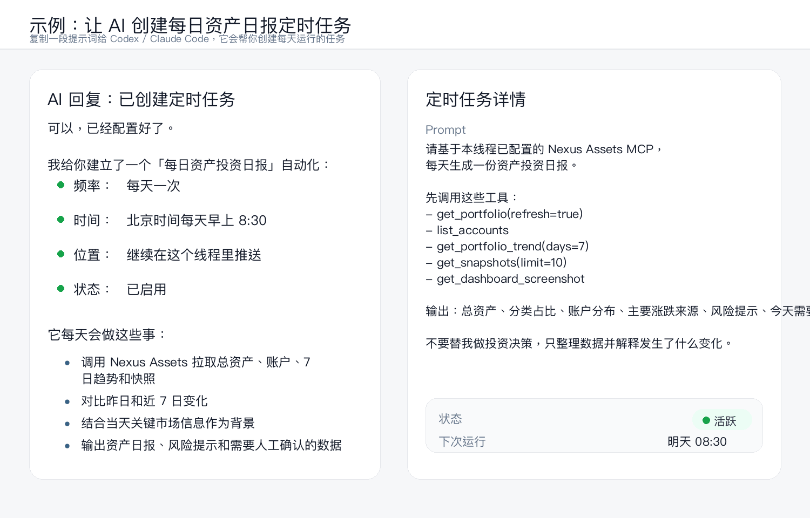
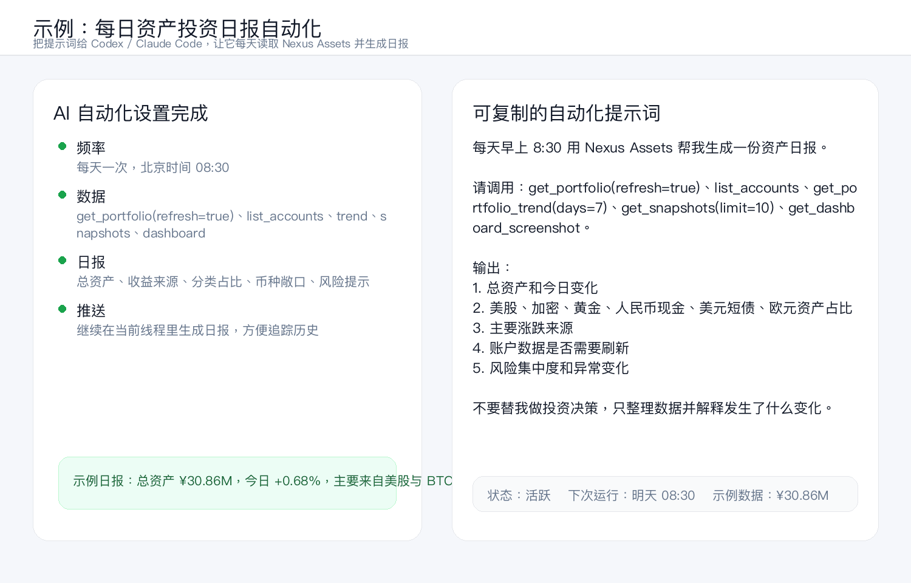
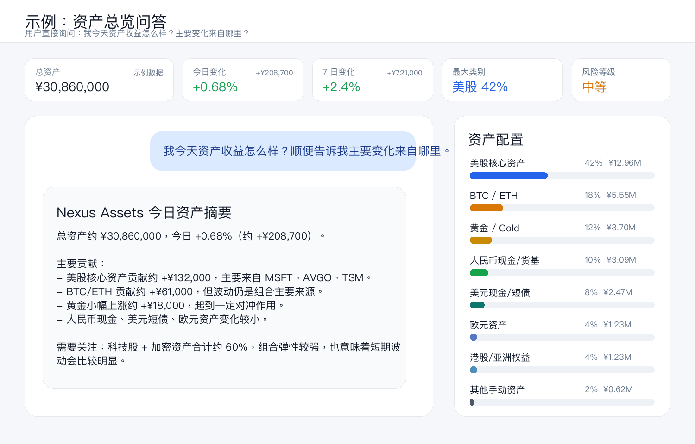
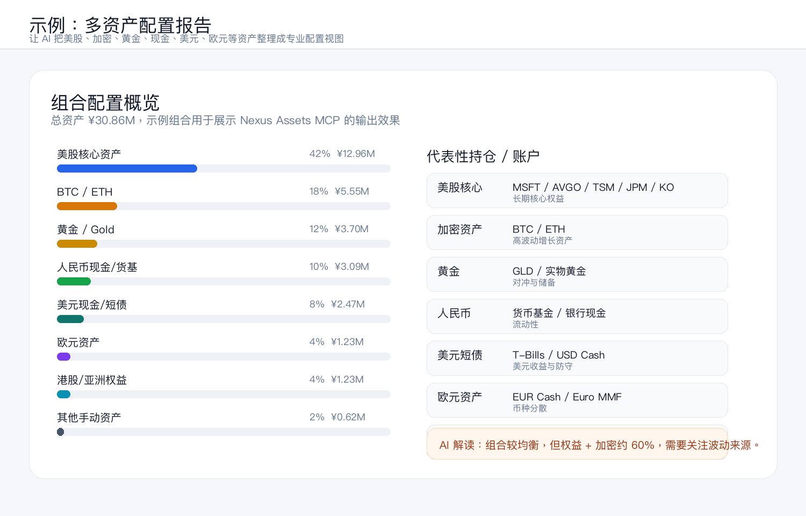
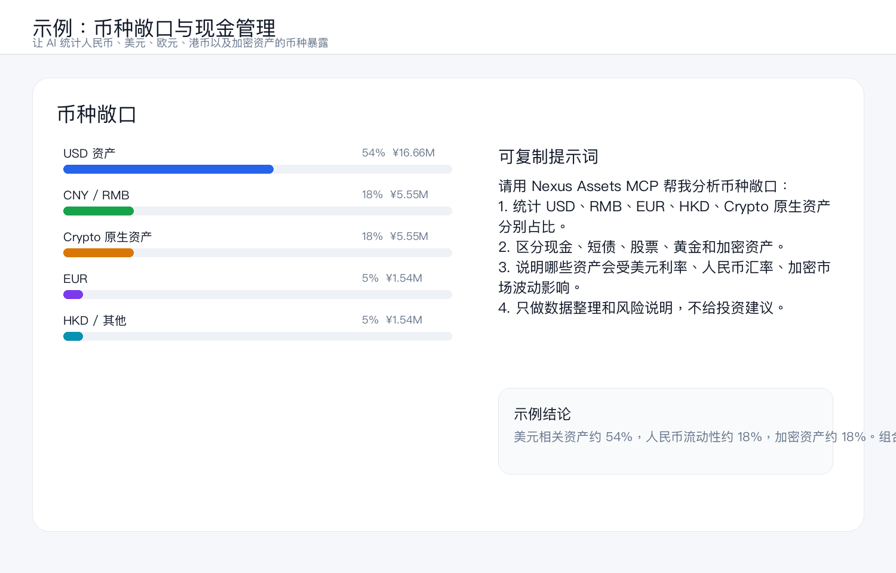
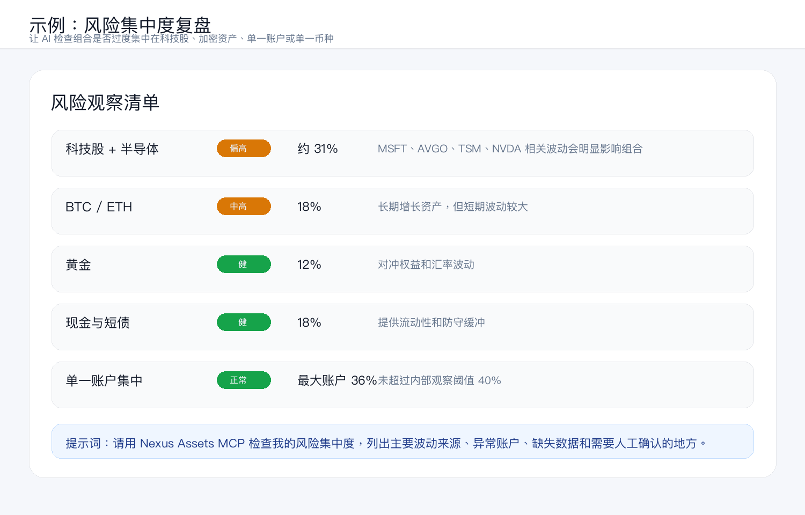
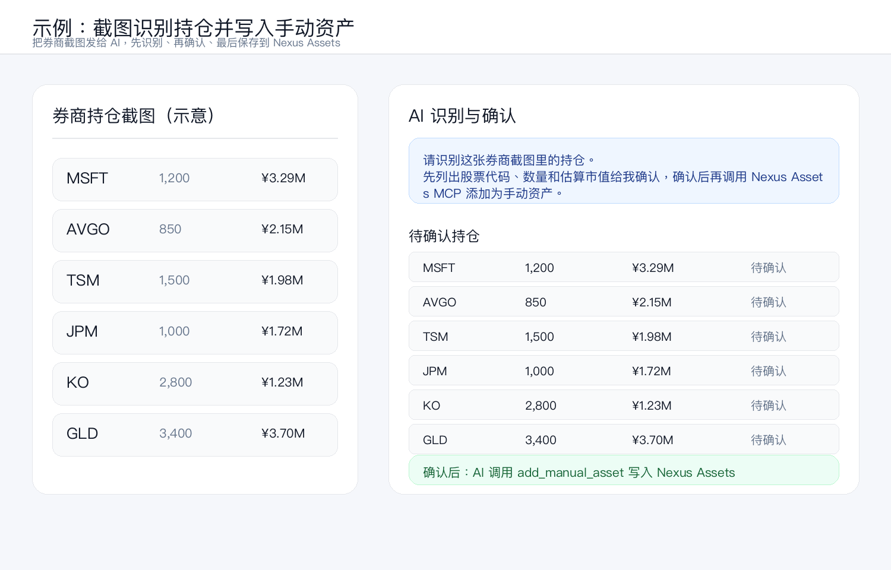

# Nexus Assets MCP Server

**Turn your AI into a private asset management assistant.**

`nexus-assets-mcp` connects [Nexus Assets](https://nexusassets.top) to Codex, Claude Code, Cursor, and other MCP-compatible AI tools. After installing it, your AI can read your private portfolio data and help you do asset management, portfolio statistics, daily performance summaries, account checks, manual asset recording, trend review, and dashboard reporting.

[中文](#中文) | [English](#english) | [Tools](#available-tools)

> For asset tracking, portfolio organization, and data analysis only. Not financial, investment, tax, or legal advice.

## What This Project Does

Nexus Assets MCP gives your AI access to your own Nexus Assets data, so you can ask questions like:

```text
How much did my portfolio change today?
Which account contributed most to today's profit or loss?
Summarize my crypto, stock, cash, and manual assets.
Create a daily portfolio report for me every morning.
Read this brokerage screenshot and prepare the positions for confirmation.
Show my 30-day asset trend and explain the main changes.
```

Typical use cases:

- **Asset management**: view all accounts, balances, categories, and manual assets in one conversation.
- **Portfolio statistics**: ask for total value, daily change, account breakdown, largest positions, and historical trends.
- **Daily reports**: ask Codex or Claude Code to generate a daily portfolio summary from your latest Nexus Assets data.
- **Screenshot workflow**: send a brokerage screenshot to your AI, let it extract positions, then confirm before saving.
- **Personal analysis**: let your AI summarize risk concentration, unusual changes, missing data, and portfolio structure.

Example prompt after installation:

```text
Every morning, use Nexus Assets to summarize my portfolio.
Include total value, daily change, top gainers/losers, account breakdown,
major position changes, and anything that needs my attention.
Do not make investment decisions for me; just organize the data and explain what changed.
```

## Example Workflows / 示例案例

The screenshots below use a demo portfolio of about **¥30.86M CNY** with diversified assets across US stocks, BTC/ETH, gold, RMB cash, USD cash/T-bills, EUR assets, HK/Asia equities, and manual assets. They are static examples only, not real user data.

下面这些图是静态示例，演示一个约 **3086 万人民币** 的多资产组合。数据不是真实用户资产，只用来展示安装 MCP 后可以实现什么效果。

### 1. Daily Portfolio Report Automation / 每日资产日报定时任务

Ask Codex or Claude Code to create a scheduled task that runs every morning and posts a portfolio report back into the same thread.



```text
请帮我创建一个每日 Nexus Assets 资产日报定时任务。
每天北京时间早上 8:30 运行。
使用 Nexus Assets MCP 获取总资产、账户列表、7 日趋势、快照和 dashboard 截图。
输出总资产、今日变化、资产配置、账户分布、主要涨跌来源、风险提示、
以及需要我人工确认的数据。
不要替我做投资决策，只整理数据并解释发生了什么变化。
```

### 2. Daily Report Prompt Detail / 日报提示词配置详情

This example shows the kind of detailed prompt you can give your AI when you want a richer daily report.



```text
请每天生成一份更详细的 Nexus Assets 资产日报。
除了总资产和涨跌，也要包含分类占比、币种敞口、账户数据是否过期、
7 日趋势、主要资产变化、需要我人工确认的异常数据。
```

### 3. Ask About Today's Portfolio Performance / 询问今日资产表现



```text
用 Nexus Assets MCP 总结我今天的资产表现。
告诉我总资产、今日变化、主要收益来源、账户变化、
以及有没有需要我关注的异常情况。
```

### 4. Multi-Asset Allocation Report / 多资产配置报告



```text
用 Nexus Assets MCP 帮我生成一份资产配置报告。
把资产分成美股、BTC/ETH、黄金、人民币现金、美元现金/短债、
欧元资产、港股/亚洲权益和手动资产。
显示每类资产的占比、金额、代表性持仓和集中度提示。
```

### 5. Currency Exposure Review / 币种敞口分析



```text
用 Nexus Assets MCP 分析我的币种敞口。
区分 USD、RMB、EUR、HKD 和 Crypto 原生资产。
说明哪些部分会受到美元利率、人民币汇率、美股、黄金和加密市场波动影响。
```

### 6. Risk Concentration Review / 风险集中度复盘



```text
用 Nexus Assets MCP 检查我的组合集中度风险。
看看我是否过度集中在科技股、半导体、BTC/ETH、单一账户、
单一币种或单一资产类别。
只总结风险和数据问题，不要替我做投资决策。
```

### 7. Screenshot Import Workflow / 截图识别持仓

Send a brokerage screenshot to your AI, let it extract positions, confirm with you, then write them into Nexus Assets as manual assets.



```text
请识别这张券商截图里的持仓。
先列出股票代码、数量和估算市值给我确认。
我确认以后，再用 Nexus Assets MCP 添加为手动资产。
```

## 中文

### 这个项目是干什么的

Nexus Assets MCP 可以把你的 Nexus Assets 资产数据接入 Codex、Claude Code、Cursor Agent 等 AI 工具。装好以后，你可以直接用自然语言问你的 AI：

```text
我今天资产收益怎么样？
今天哪个账户变化最大？
帮我统计一下股票、加密货币、现金和手动资产分别是多少。
每天早上给我生成一份资产日报。
识别这张券商截图里的持仓，先列出来给我确认。
总结最近 30 天资产变化，并告诉我主要变化来自哪里。
```

它适合做：

- **资产管理**：把交易所、券商、现金、手动资产集中起来问。
- **资产统计**：查看总资产、今日变化、账户分布、最大持仓、历史趋势。
- **每日总结**：让 Codex / Claude Code 每天读取最新数据，帮你生成资产日报。
- **截图录入**：把券商 App 截图发给 AI，让它识别持仓，确认后写入 Nexus Assets。
- **个人分析**：让 AI 帮你整理仓位集中度、异常变化、缺失数据和资产结构。

装好以后，你可以给 Codex / Claude Code 这样的提示词：

```text
每天早上用 Nexus Assets 帮我生成一份资产日报。
包含总资产、今日变化、涨跌来源、账户分布、主要持仓变化、
需要我注意的异常情况。
不要替我做投资决策，只整理数据并解释发生了什么变化。
```

### 最简单的使用方式

你不用手动研究 MCP 配置文件。按下面两步做就可以：

### 1. 生成 Token

打开 [https://nexusassets.top](https://nexusassets.top)，登录后进入：

```text
Settings / 设置 -> AI Agent Token -> Generate Token / 生成 Token
```

复制生成的 `nxa_...` token。这个 token 通常只显示一次，请先保存好。

### 2. 把下面这段话发给 Codex 或 Claude Code

把 `nxa_your_token_here` 换成你的真实 token，然后整段复制给 Codex、Claude Code、Cursor Agent 或其他能帮你改 MCP 配置的 AI 编程助手：

```text
Please install and configure the Nexus Assets MCP server for me.

MCP package:
nexus-assets-mcp

Use this command:
npx -y nexus-assets-mcp

Environment variables:
NEXUS_TOKEN=nxa_your_token_here
NEXUS_API_URL=https://nexusassets.top/api

After installing it, please verify that the MCP server is available and then test it by asking Nexus Assets for my portfolio summary.
```

然后让 AI 帮你完成安装即可。

### 可以怎么问

```text
查看我的 Nexus Assets 资产总览。
列出我的所有账户和余额。
查看最近 30 天的资产走势。
帮我添加一个手动资产：NVDA，数量 50 股。
识别这张券商截图里的持仓，先列出来给我确认。
刷新我的 Binance 账户余额。
```

### 如果 AI 需要手动配置

如果你的 AI 工具要求直接填写 MCP 配置，可以使用这段：

```json
{
  "mcpServers": {
    "nexus-assets": {
      "command": "npx",
      "args": ["-y", "nexus-assets-mcp"],
      "env": {
        "NEXUS_TOKEN": "nxa_your_token_here",
        "NEXUS_API_URL": "https://nexusassets.top/api"
      }
    }
  }
}
```

## English

### What You Can Use It For

After setup, your AI can help you check portfolio performance, summarize accounts, review historical trends, prepare daily reports, and organize manually entered assets.

Try prompts like:

```text
Use Nexus Assets to create my daily portfolio report.
Include total value, daily change, account breakdown, top assets,
major changes, and anything unusual I should review.
Do not make investment decisions for me; just summarize and explain the data.
```

### Quick Start

You do not need to manually edit MCP config files if you are using Codex, Claude Code, Cursor Agent, or another coding assistant that can configure MCP servers for you.

### 1. Generate a Token

Open [https://nexusassets.top](https://nexusassets.top), log in, then go to:

```text
Settings -> AI Agent Token -> Generate Token
```

Copy the generated `nxa_...` token. It is usually shown only once.

### 2. Send This Prompt to Codex or Claude Code

Replace `nxa_your_token_here` with your real token, then paste the whole prompt into Codex, Claude Code, Cursor Agent, or another AI coding assistant:

```text
Please install and configure the Nexus Assets MCP server for me.

MCP package:
nexus-assets-mcp

Use this command:
npx -y nexus-assets-mcp

Environment variables:
NEXUS_TOKEN=nxa_your_token_here
NEXUS_API_URL=https://nexusassets.top/api

After installing it, please verify that the MCP server is available and then test it by asking Nexus Assets for my portfolio summary.
```

That is it. Let your AI assistant handle the MCP setup.

### Example Questions

```text
Show my Nexus Assets portfolio.
List my accounts and balances.
Get my portfolio trend for the last 30 days.
Add 50 shares of NVDA as a manual asset.
Read this brokerage screenshot and list the positions for confirmation.
Refresh my Binance account balance.
```

### Manual MCP Config

If your client asks you to paste MCP config directly, use:

```json
{
  "mcpServers": {
    "nexus-assets": {
      "command": "npx",
      "args": ["-y", "nexus-assets-mcp"],
      "env": {
        "NEXUS_TOKEN": "nxa_your_token_here",
        "NEXUS_API_URL": "https://nexusassets.top/api"
      }
    }
  }
}
```

## Available Tools

| Tool | What it does |
| --- | --- |
| `get_portfolio` | Portfolio overview, total value, categories, top assets, and source breakdown |
| `get_dashboard_screenshot` | Latest dashboard screenshot URL |
| `list_accounts` | Connected exchanges, brokers, wallets, and manual asset accounts |
| `get_account_assets` | Asset breakdown for one account |
| `refresh_account` | Pull live data for a connected account |
| `get_asset_price` | Current USD and CNY price for a symbol |
| `get_portfolio_trend` | Historical portfolio trend data |
| `get_snapshots` | Daily portfolio snapshots |
| `list_manual_assets` | Existing manually entered assets |
| `add_manual_asset` | Add a manual asset after user confirmation |
| `update_manual_asset` | Update a manual asset after user confirmation |
| `delete_manual_asset` | Delete a manual asset after user confirmation |
| `add_account` | Create a new exchange or broker account connection |
| `save_account_credentials` | Save encrypted exchange or broker API credentials |

## Security

- The MCP server runs locally inside your AI client by default.
- Requests use your personal `nxa_...` token.
- A token can only access the Nexus Assets account that generated it.
- Token plaintext is shown once; the server stores only a hash.
- Exchange API credentials should be read-only.
- You can revoke tokens from Nexus Assets settings.

## Links

- Website: [https://nexusassets.top](https://nexusassets.top)
- GitHub: [https://github.com/COINsciencer/nexus-assets-mcp](https://github.com/COINsciencer/nexus-assets-mcp)
- npm: [https://www.npmjs.com/package/nexus-assets-mcp](https://www.npmjs.com/package/nexus-assets-mcp)

## License

MIT
